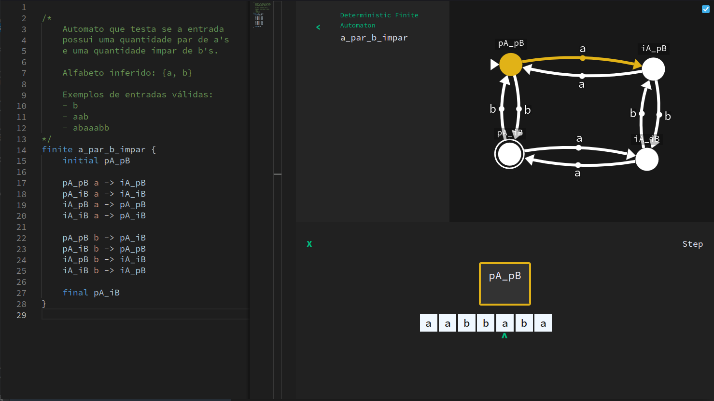

# Automata

> Automaton and formal language web tool.

With this project, you can
- Easily describe automaton and formal language concepts with an expressive custom language;
- Visualize automatons;
- Automatically visualize deterministic versions of any NDFA;
- Test the automatons step-by-step with the dedicated testing tool;
- WIP.

Check out the [website](https:krliam.github.io/automata).